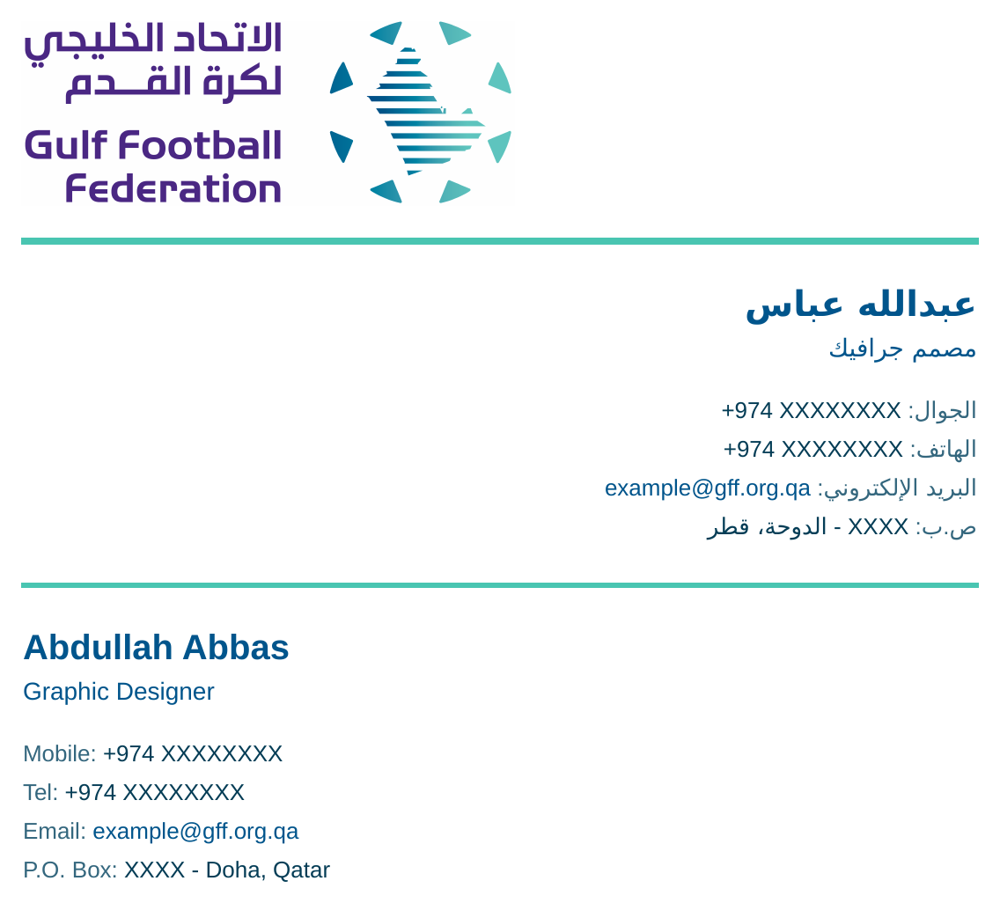

# Gulf Football Federation (GFF) — Bilingual Email Signature

One approved, premium, corporate **bilingual** email signature (Arabic first, English second),
built from the official **GFF Brand Guidelines 2025_V01** and exported to every required format
from a single source design.



---

## Brand findings (from the guidelines)

The signature was designed strictly from `assets/GFF_Brand_Guidelines.pdf`:

- **Identity:** Gulf Football Federation · الاتحاد الخليجي لكرة القدم. Crest = circular badge
  (8 shards for 8 teams, 11 lines for 11 players, united in one circle) in a blue→teal gradient.
  Tone: confident, premium, government / sports-federation.
- **Logo used:** the official **full-color master corporate lockup** (Arabic name over English name +
  crest), placed left-aligned. Extracted from page 15 of the guidelines as a high-resolution PNG.
  Minimum digital size per the guidelines is **60px** — the signature uses it at **280px** wide.
- **Typography:** official fonts are **ITC Handel Gothic** (headings) and **Codec Pro** (body). Neither
  is web/email-safe, so email-safe fallbacks are used (see below).

### Brand colors used

| Role in signature | Brand name | HEX | RGB |
|---|---|---|---|
| Name, job title, links (accent) | Extra-time Blue | `#00558C` | 0, 85, 140 |
| Dividers | Stricker Teal | `#49C5B1` | 73, 197, 177 |
| Field values | Corporate Navy *(secondary)* | `#043D56` | 4, 61, 86 |
| Field labels | Steel Blue *(secondary)* | `#34677E` | 52, 103, 126 |

Background is plain **white** `#FFFFFF`. (Other palette colors available in the brand: Matchday Purple
`#470A68`, Taupe `#C4B29F`, Sand `#E4D9C5` — not used in this layout.)

### Fonts / fallback fonts used

Official fonts are not safe for email clients, so the signature declares email-safe stacks:

- **Latin:** `Arial, Helvetica, sans-serif`
- **Arabic:** `Tahoma, Arial, sans-serif` — Tahoma has strong Arabic shaping in Outlook/Windows.

The raster/vector exports were rendered on Linux with **Noto Sans Arabic** + **Liberation Sans**
(metric-compatible stand-ins) so they closely match what recipients see.

### Logo file used

- `assets/gff-logo.png` — official full-color master lockup (also copied to `dist/gff-logo.png`
  so the signature's image path resolves locally).
- Regenerate it from the guidelines with `bash scripts/extract-logo.sh`.

---

## Project structure

```
.
├── assets/
│   ├── GFF_Brand_Guidelines.pdf     # source of all brand decisions
│   └── gff-logo.png                 # official full-color master logo (extracted)
├── src/
│   └── email-signature-source.html  # commented, easy-to-edit master
├── dist/
│   ├── email-signature.html         # production, fully inline-CSS signature
│   ├── preview.html                 # centered preview + install notes
│   ├── email-signature.png          # high-res raster (2x)
│   ├── email-signature.jpg          # white-background raster
│   ├── email-signature.pdf          # A4 sheet, signature centered
│   ├── email-signature.svg          # vector; text editable, logo embedded
│   └── gff-logo.png                 # logo copy for local path resolution
├── scripts/
│   ├── extract-logo.sh              # crop the logo from the PDF (poppler)
│   └── build_exports.py             # regenerate PNG / JPG / PDF / SVG
└── README.md
```

All formats are the **same design** — same logo placement, spacing, colors, hierarchy and
Arabic-first order.

---

## How to edit employee data

1. Open `src/email-signature-source.html`.
2. Change only the values marked with `<!-- EDIT: ... -->`:
   - Name (Arabic / English)
   - Job title (Arabic / English)
   - Mobile, Tel (keep the `+974` numbers inside their `dir="ltr"` span)
   - Email — update both the visible text **and** the `mailto:` link
   - P.O. Box + city (Arabic / English)
3. Copy the edited `<table>…</table>` over the matching block in `dist/email-signature.html`
   (identical markup), then refresh the image/PDF/SVG exports:

   ```bash
   python3 scripts/build_exports.py
   ```

Do not change the colors, fonts or table structure — they encode the approved brand design.

---

## How to install in Gmail

1. Open `dist/email-signature.html` in a browser, select the whole signature, and copy it.
2. Gmail → **Settings → See all settings → General → Signature → Create new** → paste → **Save Changes**.
3. **Host `gff-logo.png` on a public `https://` URL** and point the logo `src` at it, otherwise the
   logo will be broken for recipients (Gmail does not keep local or embedded images).

## How to install in Outlook

1. Open `dist/email-signature.html` in a browser and copy the rendered signature.
2. **New Outlook / Outlook on the web:** Settings → Mail → Compose and reply → paste into the signature box.
3. **Classic Outlook (Windows):** File → Options → Mail → Signatures → New → paste.
4. Outlook renders mail with Word; the table-based layout and Tahoma Arabic stack are chosen for this.
   Keep the logo hosted online (Outlook desktop does not support base64-embedded images).

*(Apple Mail: Mail → Settings → Signatures → paste; uncheck “Always match my default message font”.)*

---

## Export notes

- **Single source of truth:** `dist/email-signature.html`. Every other format is generated from it,
  so they always match.
- **Pipeline:** `scripts/build_exports.py` uses WeasyPrint (HTML→PDF, with Pango RTL Arabic shaping),
  poppler `pdftoppm` (PDF→PNG @192 DPI ≈ 2×) and ImageMagick (`-trim`, JPG flatten on white).
  The SVG is hand-built with real `<text>` (editable) and the official logo embedded; Arabic uses
  `text-anchor="end"` so the Unicode bidi algorithm orders it RTL correctly in browsers and editors.
- **Logo for email:** replace the local `gff-logo.png` `src` with a hosted `https://` URL before
  rolling the signature out to staff.
- **Dependencies to rebuild exports:** `poppler-utils`, `imagemagick`, `python3-weasyprint`
  (`pip install weasyprint`), and Arabic + Latin fonts (`fonts-noto-core`, `fonts-liberation`).
```bash
bash scripts/extract-logo.sh      # (re)extract the logo from the PDF
python3 scripts/build_exports.py  # (re)build PNG / JPG / PDF / SVG
```
